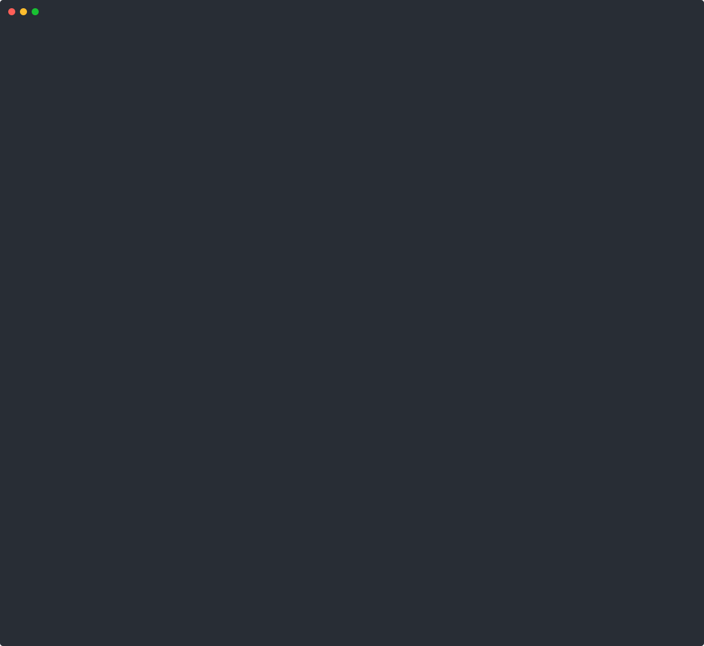

<h1>
  <picture>
    <source media="(prefers-color-scheme: dark)" srcset="docs/assets/logo-dark.svg">
    
  </picture>
</h1>

**Approve outcomes, not commands.** Start a long agent task without permission
prompts and do something else. The agent works in a copy-on-write branch of your
workspace and `$HOME`, `git push` and the commands you name wait in an outbox, and
every host it reaches is logged. When you come back, one review shows what changed and what is waiting:
apply it, take it onto a git branch, or throw it away.

[](https://github.com/getjump/airbag/actions/workflows/ci.yml)
[](LICENSE)
[](go.mod)
[](#install)
[](docs/agent.md)

[Install](#install) · [What you get](#what-you-get) · [How it compares](#how-it-compares) ·
[Threat model](#threat-model) · [FAQ](#faq) · [Docs](#docs)

> [!NOTE]
> Early v0, Linux first; macOS is a prototype. airbag is not a VM: the kernel is
> shared, and whatever the agent reads is still sent to the model API. It guards
> against accidents and casual exfiltration by an agent you let run without
> prompts; for code that may try to break out, use a VM. See the
> [threat model](#threat-model).

```console
$ curl --proto '=https' --tlsv1.2 -fsSL https://github.com/getjump/airbag/releases/latest/download/install.sh | sh
$ airbag doctor       # can this machine run airbag?
$ cd your-project
$ airbag run -- claude --dangerously-skip-permissions
$ airbag run -- codex --dangerously-bypass-approvals-and-sandbox   # or Codex
$ airbag review
$ airbag apply        # or: apply -i, apply --branch NAME, or: airbag discard
$ airbag rollback     # undo the last apply
```

On macOS, `airbag codex yolo` starts Codex with a private server and state
directory. It copies only the file-based login from `CODEX_HOME` (or
`~/.codex`); home settings, required MCP servers and host transcripts are
not imported. Pass Codex arguments after `--`, for example
`airbag codex yolo -- -m MODEL`. This launcher enables the macOS TLS trust
service outside the network proxy; `--allow-trustd=false` keeps it blocked.
See [the macOS launcher](docs/macos.md#codex-launcher).

`airbag codex yolo --execution=split` opts into a private coordinator and a
sandboxed remote executor. It requires Codex 0.160.1 and supports new TUI
conversations only. See [split execution](docs/macos.md#experimental-split-execution)
for the limits and crash quarantine.

Requirements, `go install` and Nix: [Install](#install).



The demo runs the real Claude Code; the "model" is `test/mockapi` playing a fixed
script, so it is repeatable without an account (`demo/demo.sh`). `agent ▶` lines are
the calls the model makes, `agent ◀` what the agent sends back. The same as a GIF:
`demo/demo.gif`. More scenes, one GIF each, in `demo/`: `sandbox`, `codex`, `ask`,
`apply`, `mirror` (`demo/scenes.sh NAME`; `demo/render.sh NAME` makes the SVG).

## What you get

- **[A branch of the world](docs/agent.md#files).** The workspace and `$HOME` are
  copy-on-write branches, the rest of the host is read-only. Nothing the agent
  writes to the workspace reaches your files before `airbag apply`, and almost
  nothing it writes to `$HOME`.
- **[One way out](docs/agent.md#network).** Traffic leaves only through airbag's
  proxy: model APIs and the hosts you allow, every host logged. Packages come
  through a read-only mirror.
- **[An outbox](docs/agent.md#outbox).** `git push` and the commands
  [`defer:`](docs/policies.md#deferred-commands) names wait there and run on the
  host after review.
- **[No credentials](docs/agent.md#credentials-and-secrets).** `~/.ssh`, `~/.aws`,
  `gh` and credential-like variables are hidden; a token you
  [bind to hosts](docs/policies.md#credentials) reaches the agent as a placeholder.
- **[Watched secrets](docs/agent.md#credentials-and-secrets).** The first read of
  `.env` or a key labels the session and narrows egress: only model APIs stay reachable.
- **[Less kernel to attack](docs/agent.md#terminal-and-kernel).** A seccomp filter
  refuses io_uring, `bpf`, the keyring and more; `--strict` forbids new user namespaces.
- **[One review, then your call](docs/review.md).** Apply all of it, part or none,
  or onto a new git branch; `airbag rollback` undoes an apply.
- **[Rules over effects](docs/policies.md).** [CEL](https://cel.dev) rules on observed
  effects (`net.connect`) and predicted ones (`net.egress`, `fs.delete`) answer
  `allow`, `deny` or `ask`.
- **[More than one run](docs/agent.md#sessions-and-agent-state).**
  `airbag run --session last -- claude --continue` runs the agent again on the
  same branch.

## How it compares

Isolation is not the difference. Claude Code's and Codex's built-in sandboxes run
on bubblewrap on Linux and Seatbelt on macOS, and airbag uses the same kernel
features. What differs is when you decide, and what you get to see.

Say you ask an agent to clean up a repository, and it deletes `src`, reads
`.env`, tries to post it to a paste site, appends a line to `~/.bashrc` and
pushes.

- **Built-in sandbox:** the agent stops for approval as it goes: a write
  outside the workspace, a new domain. You answer prompts mid-run and never see
  the whole result at once, and writes inside the workspace land in place.
- **airbag:** the agent runs without stopping in a branch of your machine.
  Afterwards one review shows all of it: `src` deleted, `.env` read, the upload
  blocked, the `~/.bashrc` line flagged as persistence, the push waiting in the
  outbox. `airbag discard`: the files and `~` are as they were, and the push never
  left. (A request to an allowed host would have happened when it was made; see
  below.)

| | Built-in sandbox (Claude Code, Codex) | Dev container | VM or microVM | airbag |
|---|---|---|---|---|
| Isolation | bubblewrap on Linux, Seatbelt on macOS | a container; shared kernel | its own kernel | namespaces, overlayfs and seccomp around the whole agent; shared kernel |
| You decide | during the run, at each prompt | before: mounts and network | before: what goes in | after: one review of the whole run |
| Writes to the workspace | land in place | land in place (bind mount) | stay in the VM until you copy or merge them out | stay in a branch until `apply`; `rollback` undoes an apply |
| `git push` | runs if the network allows it | runs if the network allows it | runs if the network allows it | waits in the outbox until review |
| Setup | built in | Docker and a config | a VM image and its tools | one binary, Linux 5.12+ |

As of October 2026, from each project's documentation. Corrections welcome:
[open an issue](https://github.com/getjump/airbag/issues). The full comparison with
the tools that also let you decide after the run (nono, try, AgentFS, Docker
Sandboxes, Claude Code checkpoints), and why airbag does not run on bubblewrap:
[docs/comparison.md](docs/comparison.md).

### What waits for you, and what does not

| | Until you decide | Examples |
|---|---|---|
| Stays local until `airbag apply` | the workspace and `$HOME` | edits, deletions, new files, a line in `~/.bashrc` |
| Waits in the outbox, runs after review | what airbag intercepts | `git push`, and the calls `defer:` names, such as `gh pr create` or `npm publish` |
| Decided when it happens, by the allowlist and policy | every other network request | model API calls, a request to a host you allowed, packages through the mirror; `ask` holds a call until you approve it |

A call to an outside service cannot be held or undone after the fact, so for those
the allowlist and policy decide beforehand. Review shows that they happened.

## Threat model

airbag protects against accidents and casual exfiltration by an agent you let run
without prompts. It is not a VM: the kernel is shared, and whatever the agent reads
is still sent to the model API. A bound credential keeps its value from the agent,
not its use: through the bound hosts the agent can do what the token allows.

- **The kernel.** The seccomp filter makes the shared kernel a smaller target, not
  a VM boundary. `airbag doctor` reports the host sysctls that harden the rest.
- **The network.** For hosts without a credential the proxy decides from the name
  the client asks for and does not see inside TLS, so a broad allowlist entry
  (`github.com`) is a way for data to leave. Allow narrow names, and where that
  matters put an `ask` rule on `net.connect` for the broad ones.
- **The host side.** The proxy, the forwards and the control socket run in airbag's
  process on the host. Connections that stop carrying data are closed and their
  number is capped; bandwidth and the rate of new connections are not limited.

The whole threat model, with the limits in numbers: [docs/threat-model.md](docs/threat-model.md).

## Is it for you?

It is if you let Claude Code or Codex run long tasks without permission prompts and
want to see the whole result before it reaches your files, `~` or a remote, on
Linux, with your own toolchain and without a VM. It is not for you if:

- you need a hard boundary against code that tries to break out: use a VM or a
  microVM;
- what the agent reads must not reach the model provider: airbag does not change
  what is sent to the model;
- you are on Windows, or need macOS today: the macOS port is a prototype, and
  [docs/macos.md](docs/macos.md) has the Linux VM setup that works;
- you need a hosted runtime for many users: airbag runs on your machine.

## FAQ

<details><summary>Is airbag a VM, or a hard security boundary?</summary>

No. airbag puts Linux namespaces, overlayfs and a seccomp filter around the agent,
on the host's kernel. That guards against accidents and casual exfiltration; it is
not built to hold code that tries to break out. For that, use a VM or a microVM.
</details>

<details><summary>How is it different from the sandbox built into Claude Code or Codex?</summary>

Not in isolation: airbag uses the same kernel features they do. A built-in sandbox
asks as the agent goes, and writes inside the workspace land in place. Under
airbag the agent runs without stopping in a branch, and you decide afterwards, in
one review, what to keep.
</details>

<details><summary>Does the model still see my files?</summary>

Yes. Whatever the agent reads is sent to the model API, as it is without airbag.
Known secret values are masked in the output of shell commands, but the agent's
own file tools are not filtered, so a secret the agent reads can reach its model.
The label a secret read puts on the session stops it from going anywhere else.
</details>

<details><summary>What happens to a request to a host I allowed?</summary>

It happens when the agent makes it: a call to an outside service cannot be held or
undone after the fact, so the allowlist and rules decide beforehand. An `ask` rule
blocks the call, and its retry passes once you run `airbag approve`. Review lists
every host that was reached.
</details>

<details><summary>Which agents does it work with?</summary>

Any command: `airbag run -- AGENT [ARGS...]`. Claude Code and Codex also get
airbag's hooks, so the review shows which tool call changed which file. Gemini CLI,
Aider, OpenCode and others run in the sandbox without that attribution.
</details>

<details><summary>Does it run on macOS or Windows?</summary>

Linux first. On macOS there is a native prototype (Seatbelt around the agent, an
APFS clone as the branch) and a Linux VM setup that works today; see
[docs/macos.md](docs/macos.md). There is no Windows build; under WSL2 the Linux build
runs, and an informational CI job runs the end-to-end tests there.
</details>

<details><summary>What does it cost in speed and disk?</summary>

Not measured yet; [docs/evaluation.md](docs/evaluation.md) is the plan. A session
keeps what the agent wrote under `/var/tmp/airbag-$UID` (`AIRBAG_HOME` moves it)
until you discard it, and packages the mirror fetched are cached across sessions.
</details>

<details><summary>Can I undo an apply?</summary>

The last one: `airbag rollback` puts back what was there, and the agent's changes
go back into the session to apply again or discard. A file you edited after the
apply is left as it is. A push that already ran is not undone.
</details>

## Install

```console
$ curl --proto '=https' --tlsv1.2 -fsSL https://github.com/getjump/airbag/releases/latest/download/install.sh | sh
$ airbag doctor
```

The script installs the latest release for Linux or macOS 13 and later (amd64,
arm64) into `~/.local/bin`, without sudo. It checks the archive's SHA-256 against
the release's `checksums.txt`, and when cosign or a logged-in `gh` is installed,
that the release workflow built it. `| AIRBAG_VERSION=v0.1.0 sh` picks a release,
and `| AIRBAG_VERIFY=require sh` refuses to install without the second check.
[docs/verify.md](docs/verify.md) shows how to verify a release by hand or rebuild
it. Or from source, with Go 1.27.1 or newer:
`go install github.com/getjump/airbag/cmd/airbag@latest`.

With Nix: `nix run github:getjump/airbag -- doctor`, or add the flake's
`packages.<system>.airbag` to your configuration. `nix flake check` runs the unit
tests, `nix develop` gives a shell with Go and the test tools.

One static binary, no daemon, no Docker. Needs Linux 5.12+ with unprivileged user
namespaces. On Ubuntu 23.10+ AppArmor restricts them; `airbag doctor` prints the
one-time profile to install. On macOS there is a native prototype (Seatbelt
around the agent, an APFS clone as the branch), tested in CI on macOS 15 and 26 but
not yet used on real work, and the Linux VM setup that works today; see
[docs/macos.md](docs/macos.md).

## Status

Early v0, not yet tried by anyone outside the project. Working on Linux: sandbox,
branch, proxy with allowlist and address checks, mirror, outbox for git push and
`defer:` commands, review (text, `--attention`, `--json`), diff, apply with conflict
check (all or nothing), `apply --branch`, `rollback`, `run --session`, `tcp://`
forwards, credentials through placeholders, discard. On macOS: a prototype (see above).
How the agents' hooks and the shell models work, the tests, the effect log and what
is not done yet: [docs/status.md](docs/status.md).

Deliberately left for later, each with the reason and what would bring it back
([docs/roadmap.md](docs/roadmap.md)): placeholders in `.env` files, TLS termination
for model APIs, data flow labels per value, syscall-level control, savepoints per
tool call.
Before more features comes a measurement on real work against the alternatives:
[docs/evaluation.md](docs/evaluation.md).

## Docs

- [What the agent gets](docs/agent.md): files, network, outbox, secrets, kernel, sessions
- [Review and apply](docs/review.md): `--attention`, `--json`, rollback, `apply --branch`
- [Policies](docs/policies.md): rules over effects, deferred commands, bound credentials
- [Runtime policy](docs/runtime-policy.md): opt-in file and exec checks on Linux, their audit and limits
- [Threat model](docs/threat-model.md): what airbag protects against, and what not
- [Execution boundaries](docs/execution-backends.md): `airbag capabilities`, `--require-isolation`, no fallback
- [How airbag compares](docs/comparison.md): nono, try, AgentFS, Docker Sandboxes, agentsh
- [Status in detail](docs/status.md): hooks, shell models, tests, the effect log
- [Roadmap and decisions](docs/roadmap.md): what is deferred on purpose, and why
- [Evaluation plan](docs/evaluation.md): how to tell whether airbag is worth using
- [Embedding airbag's components](docs/composition.md): the operation contracts,
  policy evaluator, outbox and credential proxy as public Go packages, the
  same code the CLI runs
- [macOS](docs/macos.md), [bubblewrap as a backend](docs/bwrap-backend.md),
  [manual test with a real login](docs/manual-test.md),
  [described operations](docs/effect-contract.md)

## Contributing

[CONTRIBUTING.md](CONTRIBUTING.md) says how to build and test airbag, and where
help changes the most. Runs on real work, and issues about review noise, false
flags and tools that break in the sandbox, are the most useful input now.

## Security

Please report security problems privately through a GitHub security advisory, not
a public issue; see [SECURITY.md](SECURITY.md).

## License

[Apache-2.0](LICENSE)
